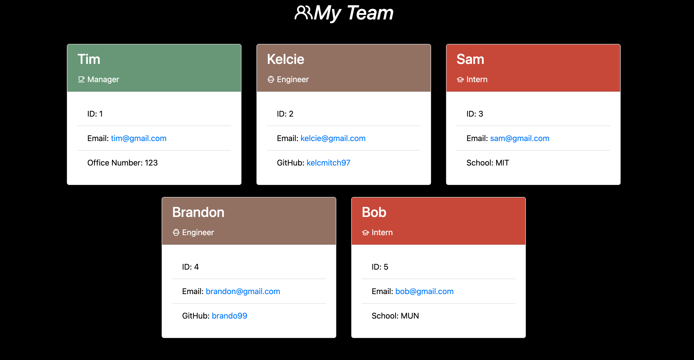

# Team Profile Generator

  

Module 10: Object Oriented Progamming Team Profile Generator Challenge

## Description 

Wish there was an application where you were able to enter in information about your team's employees that displays in a nicely formatted team roster? Well now there is! This Team Profile Generator provides users with a webpage that displays summaries about your employees based on the information you provide in this command-line application. It prompts the user with a series of questions about the employee that then quickly generates an HTML webpage. 


To see a sample team profile generated by the application, go into the 'dist' folder on this GitHub repo and open the 'index.html' file. 

## Table-of-Contents 
[Description](#description) - 
[Installation](#installation) - 
[Tutorial](#tutorial) - 
[Usage](#usage) - 
[Questions](#questions)

## Installation

To use this team profile generator, you can download the zip file and copy it to a directory of your choice or you can clone this repo to a directory of your choice using your terminal. 

Once you have this repo on your local machine, you can open the file in the editor of your choice and navigate to the root directory "10-team-profile-generator". Now your ready to run the application in your terminal with the following command:

```
node index.js

```

## Tutorial

[Walkthrough Tutorial of Team Profile Generator App](https://drive.google.com/file/d/1C6cGG7vzRR4zmUCx1O1-YkINQ_8YNOJt/view)

Test index.html team profile created from the team profile generator can be seen below:



## Usage 

After the installation is complete, you will need to run 'node index.js' in the terminal. Go through the various prompts with what you would like your employee roster to include and after completion, your answers will be displayed in the console. Your generated team roster file will be under the 'dist' folder called "index.html". Now you can open this in the browser to view your team profiles!

## Questions

Please contact me using the following links: 

[GitHub](https://github.com/kelcmitch97)

[Email:](kelciemitchelmore@gmail.com) kelciemitchelmore@gmail.com


